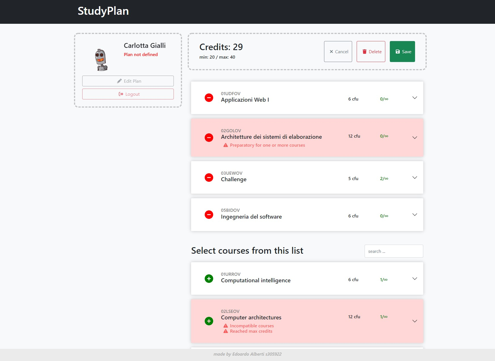

# Exam #1: "StudyPlan"

## Commands for running the server and the client

server: `cd server; npm i; npm start`

client: `cd client; npm i; npm start`

## React Client Application Routes

- Route `/`: home page with the full list of courses
- Route `/plan`: page showing the user defined plan (if present)
- Route `/plan/edit`: page where it's possible to define/edit/delete a study plan

## API Server

### Sessions

- GET `/api/v1/sessions/current`

  - request: must include credentials
  - response: `200` (current USER_OBJ), `401` (unauthorized)

- POST `/api/v1/sessions`

  - request: LOGIN_OBJ
  - response: `201` (requested USER_OBJ), `401` (unauthorized)

- DELETE `/api/v1/sessions/current`
  - request: empty
  - response: `204`

```json
--- USER_OBJ ---
{
 "email": "luigi.verdi@studenti.it",
 "name": "Luigi",
 "surname": "Verdi",
 "hasStudyPlan": true,
 "partTime": true
}

--- LOGIN_OBJ ---
{
 "email": "luigi.verdi@studenti.it",
 "password": "password"
}
```

### Courses

- GET `/api/v1/courses`
  - request: empty
  - response: `200` (list of COURSE_OBJ)
- GET `/api/v1/courses/:code`
  - request: param containing the requested course's code
  - response: `200` (requested COURSE_OBJ)

```json
--- COURSE_OBJ ---
{
  "code": "02GOLOV",
  "name": "Architetture dei sistemi di elaborazione",
  "credits": 12,
  "maxStudents": null,
  "preparatoryCourse": null,
  "choosenBy": 1,
  "incompatibleWith": [
   "02LSEOV"
  ]
 }
```

### StudyPlans (must be authenticated)

- GET `/api/v1/studyPlans/plan`
  - request: must include credentials
  - response: `200` (list of COURSE_OBJ), `401` (unauthorized)
- POST `/api/v1/studyPlan`
  - request: must include credentials, CODES_OBJ
  - response: `201`, `401` (unauthorized)
- DELETE `/api/v1/studyPlans/plan`
  - request: must include credentials
  - response: `204`, `401` (unauthorized)

```json
--- COURSE_OBJ ---
{
  "code": "02GOLOV",
  "name": "Architetture dei sistemi di elaborazione",
  "credits": 12,
  "maxStudents": null,
  "preparatoryCourse": null,
  "choosenBy": 1,
  "incompatibleWith": [
   "02LSEOV"
  ]
 }

 --- CODES_OBJ ---
{
 "partTime": true,
 "courses": [
  "01UDUOV",
  "01SQOOV",
  "02GRSOV",
  "01OUZPD",
  "01URSPD"
 ]
}
```

## Database Tables

- Table `Courses` - code, name, credits, maxStudents, preparatoryCourse, enrolledStudents
- Table `Courses_Incompatible` - ID, course, incompatibleWith
- Table `Students` - email, name, surname, partTime, hasStudyPlan password, salt
- Table `Students_Courses` - ID, student, course

## Main React Components

- `Course` (in `Course.js`): Display one course's info inside an Accordion
- `CourseList` (in `CourseList.js`): Display a collection of Course components (can perform checks when needed)
- `MainLayout` (in `MainLayout.js`): Backbone of the web page, defines the layout
- `Plan` (in `Plan.js`): Display user's StudyPlan with the options to edit/delete it
- `Sidebar` (in `Sidebar.js`): Login and user's info box

## Screenshot

### localhost:3000/plan/edit



## Users Credentials

- mario.rossi@studenti.it, password
- federica.bianchi@studenti.it, password
- luigi.verdi@studenti.it, password
- ferdinand.black@studenti.it, password
- carlotta.gialli@studenti.it, password
